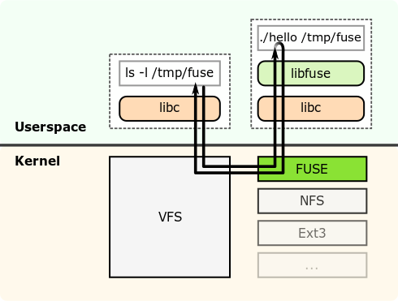

# Introduction: What is IOFS?

## Motivation

It is very hard to analyze I/O requests and their performance as there are many parameters that determine request time, like

- Page alignment
- VFS scheduling
- Process scheduling and priority
- Network congestion
- Running programs
- File system configuration

and many more. Normal analysis tools often need sophisticated knowledge, elevated access and/or custom code adjustments.

For example, here is an overview of Linux highly complex I/O architecture:

This results in most programmers, especially interdisciplinary researchers, not being able to sufficiently optimize their
I/O accesses. We try to solve this problem with a pure blackbox approach.

Our goals with our solution are the following:

- Give all HPC users a tool to monitor and rudimentary analyze their I/O
- Require no code changes, no specific compiler, no specific linking
- Easy to set up, no propriatary software or specfic knowledge required
- Completely run in user space, no administration required
- Integrate in common tooling for further analysis
- Require no assumptions about the underlying server topology

## Our Approach

As mentioned above, we developed `iofs` as a blackbox approach to report and, together with [`blackheap`](https://github.com/lquenti/blackheap), classify all I/O requests without requiring any further information about the I/O hardware or software configuration.

### FUSE

We use the Linux userspace filesystem framework [FUSE](https://en.wikipedia.org/wiki/Filesystem_in_Userspace) (Filesystem in Userspace) in order to intercept all I/O requests. FUSE works as follows:

FUSE consists of two parts: The FUSE kernel module and the `libfuse` library to build file systems. We use FUSE to insert our monitoring logic.

### Grafana / Elasticsearch / InfluxDB

In order to allow for easier aggregated analysis of multiple clusters, we support data streaming.

Our inhouse data monitoring setup is set up as follows:

### Monitoring

Although we use [Grafana](https://grafana.com/) as our monitoring platform, `iofs` is platform agnostic, as it directly inserts the data into the underlying database.

### Database

We use the [InfluxDB](https://www.influxdata.com/) TSDB (Time Series DataBase) as our data source for Grafana. `iofs` currently only supports the [InfluxQL](https://docs.influxdata.com/influxdb/v1.8/query_language/) API, not the [Flux](https://docs.influxdata.com/influxdb/v1.8/flux/) Syntax. Furthermore, `iofs` is only tested for InfluxDB 1.x.

We also have some streaming logic to support [Elasticsearch](https://www.elastic.co/de/elasticsearch/) as a TSDB, although this is not tested nor actively maintained.

### How it works

In order to track and monitor the I/O requests, the user is required to "proxy" all requests through our pseudo-filesystem. Once this is done, the high level workflow works as follows:

- User does a request on our pseudo filesystem
- The request goes to the Linux VFS
- The Linux VFS sees that this is a FUSE filesystem and lets the FUSE kernel module manage the request
- The FUSE kernel module calls the appropriate `iofs` method for the requested operation.
- `iofs` extracts all request informations.
  - Then it maps the path to the real path
  - Does the underlying file system operation
  - Tracks how long the request takes
  - Aggregates all measured data into some global data structure
  - returns the result of the underlying operation
- The result gets passed to the FUSE kernel module, then gets passed to the VFS module, then gets passed to the caller.

Every time interval, all aggregated metrics get streamed to any of the two TSDB supported. Note that this is non-blocking.
